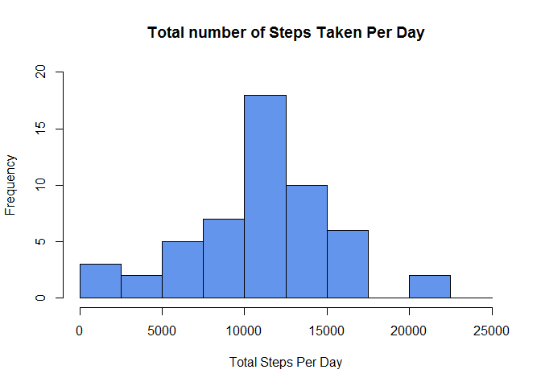
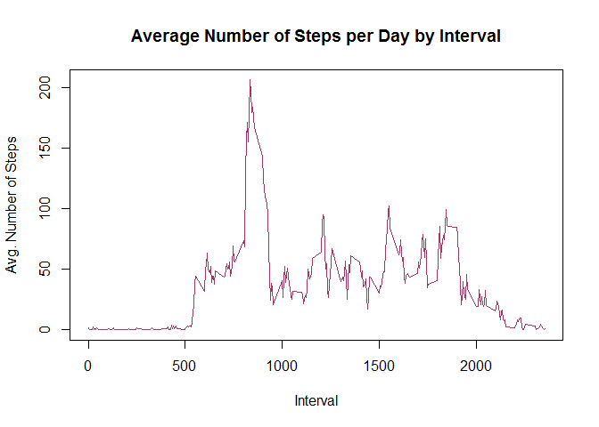
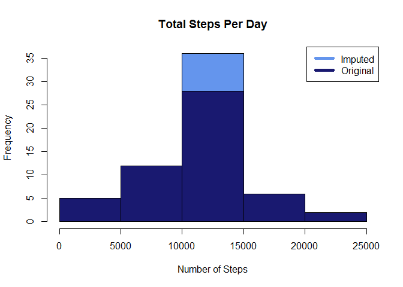

## Setting Global Options to turn warnings off and to echo all results


```r
knitr::opts_chunk$set(echo = TRUE, warning = FALSE)
```

## Loading & Pre-processing the data

The data is unzipped and read. Dimensional exploration is carried out to find the class of each column.


```r
activity <- read.csv(unz("activity.zip", "activity.csv"))
sapply(activity,class)
```

```
##     steps      date  interval 
## "integer"  "factor" "integer"
```

activity\$date is converted from factor to date class and a column for weekdays is created using activity$date and binded to the activity dataset.


```r
activity$date <- as.POSIXct(activity$date, "%Y-%m-%d")
weekday <- weekdays(activity$date)
activity <- cbind(activity,weekday)

summary(activity)
```

```
##      steps             date               interval           weekday    
##  Min.   :  0.00   Min.   :2012-10-01   Min.   :   0.0   Friday   :2592  
##  1st Qu.:  0.00   1st Qu.:2012-10-16   1st Qu.: 588.8   Monday   :2592  
##  Median :  0.00   Median :2012-10-31   Median :1177.5   Saturday :2304  
##  Mean   : 37.38   Mean   :2012-10-31   Mean   :1177.5   Sunday   :2304  
##  3rd Qu.: 12.00   3rd Qu.:2012-11-15   3rd Qu.:1766.2   Thursday :2592  
##  Max.   :806.00   Max.   :2012-11-30   Max.   :2355.0   Tuesday  :2592  
##  NA's   :2304                                           Wednesday:2592
```

## 1. What is mean total number of steps taken per day?

The total number of steps taken each day are calculated and stored in the object totalSteps, to do this missing values are removed. A histrogram is plotted to depict the frequency of different total steps.


```r
totalSteps <- aggregate(steps ~ date, rm.na = TRUE, data = activity, FUN = sum)

names(totalSteps) <- c("date", "steps")
hist(totalSteps$steps, ylim = c(0,20), breaks = seq(0,25000, by=2500),
     main = "Total number of Steps Taken Per Day", 
     xlab = "Total Steps Per Day", ylab ="Frequency", col = "cornflowerblue")
```

<!-- -->

The $mean$ number of total steps taken in a day is as follows:


```r
activityMean <- mean(totalSteps$steps)
```

mean = 1.0767189\times 10^{4}

The $median$ of the total steps taken per day is as below:


```r
activityMedian <- median(totalSteps$steps)
```

median = 10766

## 2. What is the average daily activity pattern?

A time series plot of the 5-minute interval (x-axis) and the average number of steps taken, averaged across all days (y-axis).


```r
intervalSteps <- aggregate(steps ~ interval, activity, mean)

plot(intervalSteps$interval,intervalSteps$steps, type="l", xlab="Interval", 
     col ="maroon", ylab="Avg. Number of Steps",
     main="Average Number of Steps per Day by Interval")
```

<!-- -->

```r
maxSteps <- intervalSteps[which.max(intervalSteps$steps),1]
```

The 5-minute interval, on average across all the days in the dataset, that contains the maximum number of steps is 835.

## 3. Imputing missing values

There are several days/intervals that have missing values (coded as NA). Thismay introduce bias into the summaries or calculations of the data. 


```r
missing <- sum(is.na(activity$steps))
```
The total number of missing values in the dataset are 2304. The missing values have been imputed by inserting the average for each interval.


```r
imputed_activity <- transform( activity, steps = ifelse(is.na(activity$steps),                                                           intervalSteps$steps[match(activity$interval,
                               intervalSteps$interval)],activity$steps))                                                                                                                            
```
A histogram depicting the total number of steps taken each day is shown below. It depicts the number of steps for both the original and imputed dataset.


```r
imputed_totalSteps <- aggregate(steps ~ date, imputed_activity, sum)

hist(imputed_totalSteps$steps, main = "Total Steps Per Day",
     col="cornflowerblue", xlab="Number of Steps")
hist(totalSteps$steps, col="midnightblue", add=T)

legend("topright", c("Imputed", "Original"), col=c("cornflowerblue", 
                                                      "midnightblue"), lwd=5)
```

<!-- -->

The following code calculated the mean and median or imputed data. Along with the difference in the means and medians of the imputed and original data. Finally, it calculates the difference in the total number of steps between the two datasets.


```r
imputed_mean <- mean(imputed_totalSteps$steps)
imputed_median <- median(imputed_totalSteps$steps)

meanDiff <- imputed_mean - activityMean
medianDiff <- imputed_median - activityMedian

diffTotal <- sum(imputed_totalSteps$steps) - sum(totalSteps$steps) 
```

- Imputed Mean = 1.0766189\times 10^{4}
- Imputed Median = 1.0766189\times 10^{4}
- Imputed Mean - Original Mean = -1
- Imputed Median - Original Median = 0.1886792
- Imputed Total Steps - Original Total Steps = 8.6076509\times 10^{4}

## 4. Are there differences in activity patterns between weekdays and weekends?

A new factor variable in the dataset is created with two levels - "weekday" and "weekend" indicating whether a given date is a weekday or weekend day.


```r
weekend <- c( "Saturday", "Sunday")
imputed_activity$dayType = as.factor(ifelse
                                     (is.element
                                             (weekdays(imputed_activity$date)
                                                     ,weekend),"Weekend", "Weekday"))

imputed_intervalSteps <- aggregate(steps ~ interval + dayType,
                                   imputed_activity, mean)
```

A panel plot containing a time series plot (i.e. type = "l") of the 5-minute interval (x-axis) and the average number of steps taken, averaged across all weekday days or weekend days (y-axis) is shown below:


```r
library(ggplot2)

plot<- ggplot(imputed_intervalSteps, aes(x = interval , y = steps, color = dayType)) +
       geom_line() +
       labs(title = "Average Daily Steps: Weekday vs. Weekend",
            x = "5 - Minutes Interval", y = "Avg. Number of Steps") +
        
       facet_wrap(~dayType, ncol = 1, nrow=2)

print(plot)
```

-1.png)<!-- -->
